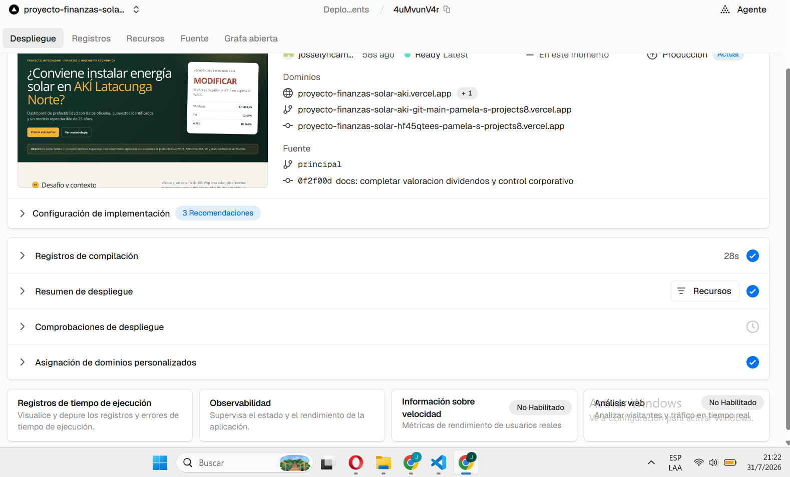
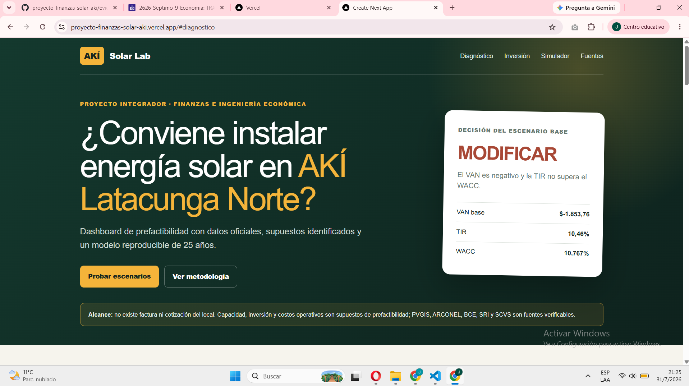

# Evidencia 15: despliegue y validación del dashboard en Vercel

## 1. Objetivo

Documentar el despliegue público del dashboard, los errores encontrados, la corrección aplicada y la validación humana del resultado.

## 2. Herramientas utilizadas

- Visual Studio Code.
- Codex como apoyo de programación y revisión.
- Git y GitHub para control de versiones.
- Node.js, npm, Next.js y TypeScript.
- Vercel para compilación y despliegue.

No se utilizó Python.

## 3. Datos del despliegue aprobado

| Campo | Resultado |
|---|---|
| Proyecto | `proyecto-finanzas-solar-aki` |
| Entorno | Producción |
| Estado | Ready |
| URL pública | https://proyecto-finanzas-solar-aki.vercel.app |
| Rama | `main` / `principal` |
| Commit desplegado | `0f2f00d` |
| Framework | Next.js |
| Duración observada | 28 segundos |
| Fecha de validación | 31 de julio de 2026 |

## 4. Error identificado

El primer intento compiló las rutas de Next.js, pero Vercel mostró el error `DEPLOYMENT_NOT_FOUND` y señaló que no encontraba el directorio de salida. La revisión humana comprobó que la opción **Anular directorio de salida** estaba activada, por lo que la configuración automática de Next.js había sido sobrescrita.

La respuesta inicial que interpretó el visto del proyecto como despliegue terminado fue rechazada al abrir la URL y observar el error 404. Este caso demuestra que un indicador del panel no sustituye la validación directa del enlace público.

## 5. Corrección aplicada

1. Se ingresó a los ajustes específicos del proyecto.
2. Se confirmó el framework Next.js.
3. Se desactivó la anulación del directorio de salida.
4. Se guardó la configuración.
5. Se ejecutó una redistribución en producción sin reutilizar la caché anterior.
6. Se esperó el estado `Ready Latest`.
7. Se abrió el dominio público y se comprobó visualmente el dashboard.

## 6. Validación realizada por la estudiante

La estudiante verificó directamente que:

- el dominio público abre sin autenticación;
- se muestra el título del desafío de AKÍ Latacunga Norte;
- aparecen VAN, TIR y WACC del escenario base;
- la recomendación visible es `MODIFICAR`;
- el dashboard advierte que no existe factura ni cotización del local;
- los controles de navegación y simulación están disponibles;
- el proyecto se encuentra en producción.

## 7. Decisión humana

Se aceptó el despliegue únicamente después de abrir el dominio público. Se rechazó la primera interpretación del estado porque el enlace devolvía 404. La corrección no modificó los datos ni los cálculos financieros; solo restableció la configuración de compilación automática de Next.js.

## 8. Evidencia visual

### Estado Ready en Vercel

### Dashboard público operativo

## 9. Limitaciones

El despliegue valida la disponibilidad técnica y pública del dashboard, pero no convierte los supuestos de prefactibilidad en datos observados. La factura, el techo, las cotizaciones y el financiamiento del local continúan pendientes.

